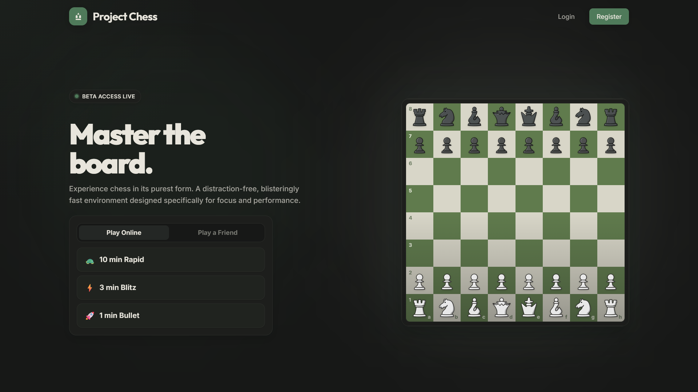
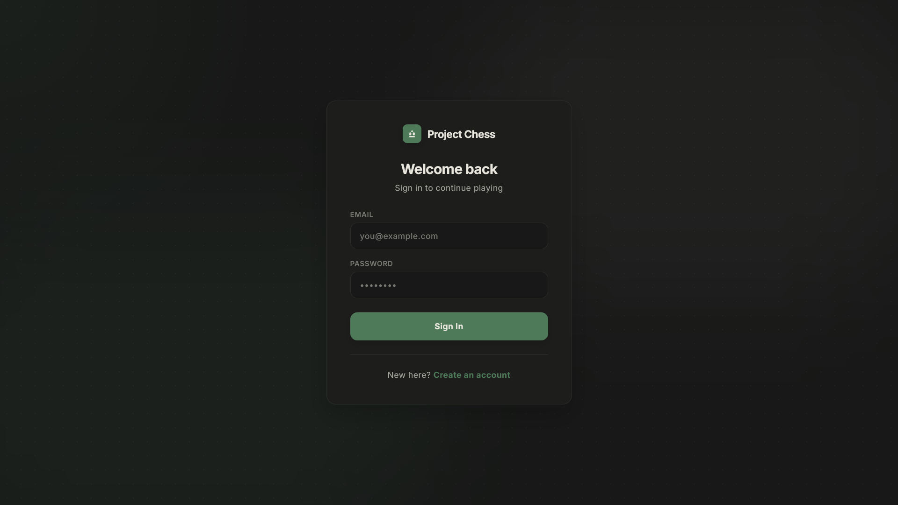
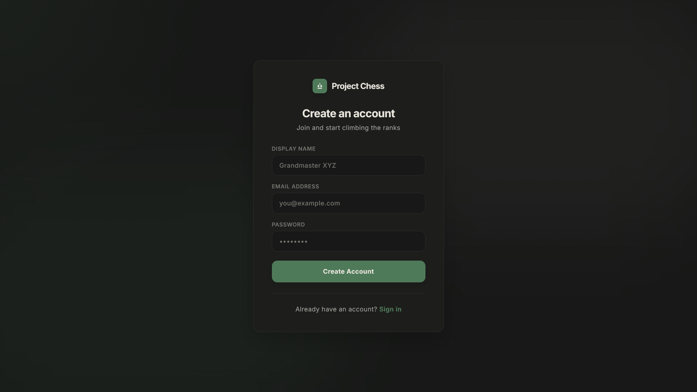
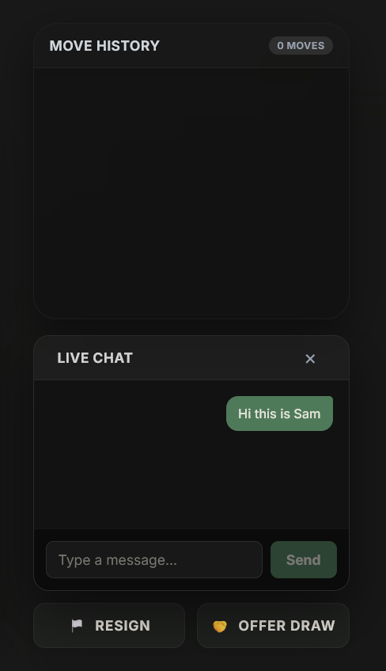
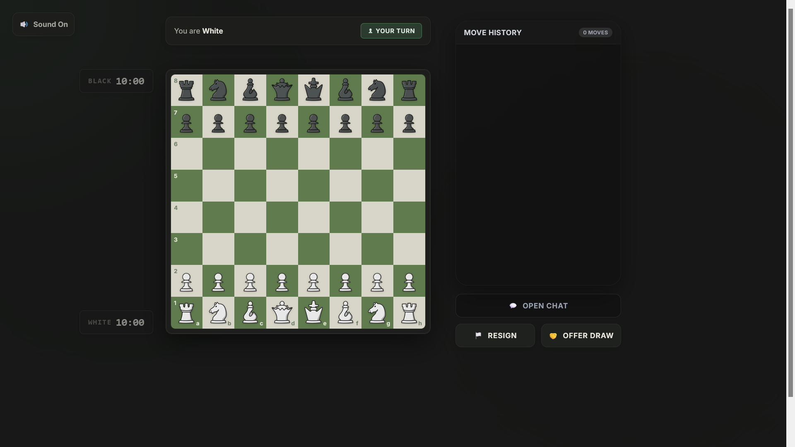

# Chess.app

A real-time multiplayer chess application built with React, Node.js, and WebSocket-driven gameplay.

## Overview
Chess.app is a browser-based chess platform for live matches, matchmaking, private rooms, account-based play, and rating tracking. The project combines a React frontend with a Node.js backend and a Prisma-managed SQLite database.

## Live Demo
Coming soon.

## Screenshots

### Landing page


### Login and registration



### Live game and chat



## Key Features
- Real-time chess gameplay with WebSocket updates
- Matchmaking and private room support
- Player login and registration flow
- In-game live chat
- Move history and board state tracking
- Elo rating updates after game completion
- User profile and recent game history
- Resign and draw controls

## Tech Stack
### Frontend
- React
- TypeScript
- Vite
- Tailwind CSS
- chess.js

### Backend
- Node.js
- Express
- WebSocket (ws)
- Prisma
- SQLite
- JWT authentication

## Simple Architecture
```text
Frontend (React + Vite)             Backend (Express + WebSocket)
        |                                     |
        | --- REST auth requests ----------> |
        |                                     |
        | --- game events / chat ----------> |
        |                                     |
        | <--- board + status updates ------ |
        |                                     |
        +------------------ Prisma --------------------+
                           SQLite database
```

## Project Structure
```text
Chess.app/
├── backend1/
│   ├── prisma/
│   ├── src/
│   ├── .env
│   ├── package.json
│   └── tsconfig.json
├── docs/
│   ├── landing.png
│   ├── login.png
│   ├── register.png
│   ├── livechat.png
│   └── game.png
├── frontend/
│   ├── public/
│   ├── src/
│   ├── package.json
│   └── vite.config.*
├── README.md
├── package-lock.json
└── .gitignore
```

## Local Setup
### 1. Install backend dependencies
```bash
cd backend1
npm install
```

### 2. Configure environment variables
Create a `.env` file in `backend1/` with:
```env
JWT_SECRET=your-secret-key
DATABASE_URL="file:./dev.db"
```

### 3. Run Prisma migrations
```bash
cd backend1
npx prisma migrate dev
```

### 4. Start the backend
```bash
cd backend1
npm run dev
```

### 5. Install frontend dependencies
```bash
cd frontend
npm install
```

### 6. Start the frontend
```bash
cd frontend
npm run dev
```

Open `http://localhost:5173` in the browser.

## Environment Variables
```env
JWT_SECRET=your-secret-key
DATABASE_URL="file:./dev.db"
```

## Future Improvements
- Add richer matchmaking filters and queue tuning
- Improve game analytics and match history insights
- Add reconnect handling and reconnect recovery for live sessions
- Expand spectator and tournament features
- Improve UI polish and accessibility

## Author
Vinay SH
